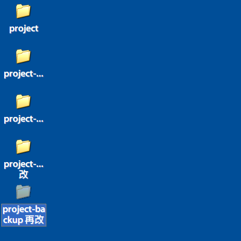
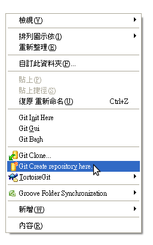
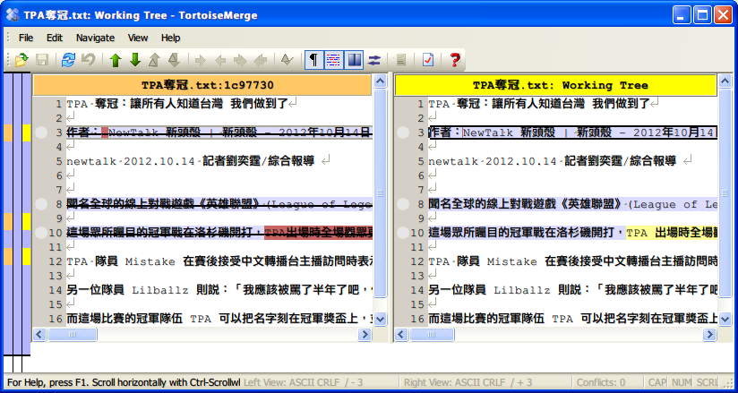

#增進工作效能－電腦小工具介紹#

* C1A
* Andrew Chen

---

* C1A
* Andrew Chen

---
layout: default
title: ""
published: true
classes:
 - step
data:
  x: 2000
  y: 0
  scale: 4

---

難題

---
layout: default
title: ""
published: true
classes:
 - step
data:
  x: 3000
  y: 0
  scale: 4

---

技客**融入**生活

---
layout: default
title: ""
published: true
classes:
 - step
data:
  x: 4000
  y: 0
  scale: 4

---

雜誌、網誌

---
layout: default
title: ""
published: true
classes:
 - step
data:
  x: 5000
  y: 0
  scale: 4

---

譁眾取寵

---
layout: default
title: ""
published: true
classes:
 - step
data:
  x: 6000
  y: 0
  scale: 4

---

永續發展

---
layout: default
title: ""
published: true
classes:
 - step
data:
  x: 2500
  y: 2000
  scale: 4

---

發生問題

---
layout: default
title: ""
published: true
classes:
 - step
data:
  x: 3500
  y: 2000
  scale: 4

---

找出問題

---
layout: default
title: ""
published: true
classes:
 - step
data:
  x: 4500
  y: 2000
  scale: 4

---

解決問題

---
layout: default
title: ""
published: true
classes:
 - step
data:
  x: 4500
  y: 3000
  scale: 4

---

製造更多問題？

---
layout: default
title: ""
published: true
classes:
 - step
data:
  x: 4000
  y: 0
  scale: 3

---

---
layout: default
title: ""
published: true
classes:
 - step
data:
  x: 5000
  y: 0
  scale: 3

---

---
layout: default
title: ""
published: true
classes:
 - step
data:
  x: 6000
  y: 0
  scale: 3

---

---
layout: default
title: ""
published: true
classes:
 - step
data:
  x: 7000
  y: 0
  scale: 3

---

---
layout: default
title: ""
published: true
classes:
 - step
data:
  x: 8000
  y: 0
  scale: 3

---

---
layout: default
title: ""
published: true
classes:
 - step
data:
  x: 9000
  y: 0
  scale: 3

---

---
layout: default
title: ""
published: true
classes:
 - step
data:
  x: 10000
  y: 0
  scale: 3

---

---
layout: default
title: ""
published: true
classes:
 - step
data:
  x: 11000
  y: 0
  scale: 3

---

---
layout: default
title: ""
published: true
classes:
 - step
data:
  x: 1500
  y: 4000
  scale: 4

---

版本控制

---
layout: default
title: ""
published: true
classes:
 - step
data:
  x: 0
  y: 7000
  scale: 4

---

對資料夾作存檔行為

---
layout: default
title: ""
published: true
classes:
 - step
data:
  x: 2000
  y: 7000
  scale: 4

---

不再複製資料夾

---
layout: default
title: ""
published: true
classes:
 - step
data:
  x: 5000
  y: 8000
  rotate: 90

---

只要先初始化資料夾

---
layout: default
title: ""
published: true
classes:
 - step
data:
  x: 5000
  y: 9000
  rotate: 90

---

第一次存檔

commit 提交

---
layout: default
title: ""
published: true
classes:
 - step
data:
  x: 5000
  y: 10000
  rotate: 90

---

存檔留言

commit message 提交訊息

---
layout: default
title: ""
published: true
classes:
 - step
data:
  x: 5000
  y: 11000
  rotate: 90

---

經過幾次存檔

---
layout: default
title: ""
published: true
classes:
 - step
data:
  x: 5000
  y: 12000
  rotate: 90

---

我們可以看 xls 的修改差異

---
layout: default
title: ""
published: true
classes:
 - step
data:
  x: 5000
  y: 13000
  rotate: 90

---

我們可以看 txt 的修改差異

---
layout: default
title: ""
published: true
classes:
 - step
data:
  x: 0
  y: 13000

---

Live Demo

傳說 Live Demo 一定會出包

---
layout: default
title: ""
published: true
classes:
 - step
data:
  x: 0
  y: 14000

---

除了本地自我管理之外

---
layout: default
title: ""
published: true
classes:
 - step
data:
  x: 0
  y: 15000

---

思考因地適宜的應用

---
layout: default
title: ""
published: true
classes:
 - step
data:
  x: 1000
  y: 15000

---

網芳

---
layout: default
title: ""
published: true
classes:
 - step
data:
  x: 2000
  y: 15000

---

額外的儲存空間？

---
layout: default
title: ""
published: true
classes:
 - step
data:
  x: 3000
  y: 15000

---

共同存取空間

---
layout: default
title: ""
published: true
classes:
 - step
data:
  x: 4000
  y: 15000

---

協同作業

---
layout: default
title: ""
published: true
classes:
 - step
data:
  x: 4000
  y: 15000

---

版本控制集結點

---
layout: default
title: ""
published: true
classes:
 - step
data:
  x: 4000
  y: 15000

---

建立一個集結點

